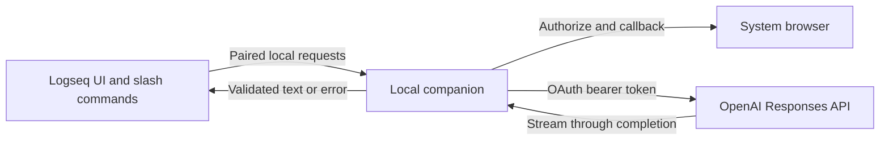

# Codex OAuth / Sign in with ChatGPT investigation

Status: design proposal, 2026-10-05. This document proposes a follow-up implementation; it does
not add login or change how commands run. It is stacked on the OpenAI compatibility cleanup.

## Recommended approach

Add an optional **Continue with ChatGPT** connection using OpenAI's documented local open-source
sign-in flow. Keep the existing API-key connection for OpenAI-compatible Chat Completions servers.
OpenAI now documents ChatGPT plan usage for eligible local open-source tools, including account
registration without a client secret or a partner API key. Availability depends on the user's
account and granted permissions. [Official overview](https://developers.openai.com/siwc/token-sharing-open-source).

Use a small local companion process for OAuth and inference. The current plugin runs through
Logseq's browser-facing SDK; it has no implemented callback listener, protected token store or
process bridge. The companion is a proposed way to supply those capabilities without requiring
a change to Logseq. The first prototype must verify browser access to a loopback service in both
supported graph runtimes, including origin/CORS behavior and companion discovery.

OpenAI's desktop example keeps authentication, protected storage and inference in the main
process, exposing a narrow bridge to the interface. We can apply the same separation through a
companion because this project is a plugin rather than the Electron host.
[Desktop integration example](https://developers.openai.com/cookbook/articles/sign-in-with-chatgpt).

## OAuth lifecycle

The companion prepares a stable installation host ID, opens a loopback callback listener, and
starts authorization with fresh state, nonce and PKCE values. First sign-in uses
`client_id=dynamic_agent_client`; save the client ID issued by registration for later sign-ins.
Use the documented identity and ChatGPT plan scopes and validate the ID token and granted
permission before activating the connection. Denied or cancelled login keeps the current
connection active. No production sign-in was performed during this investigation.
[Registration and sign-in](https://developers.openai.com/siwc/token-sharing-open-source/sign-in).

Each account/workspace registration needs its own client ID and credentials. Store tokens in
protected companion storage, refresh before expiry with serialized refreshes, and persist token
rotation atomically. Signing out ends the renewable session and clears local tokens. The plugin
receives account display information and connection status; its settings do not store OAuth
tokens. Provide an account picker and a Manage usage action.
[Accounts and sessions](https://developers.openai.com/siwc/token-sharing-open-source/profiles-and-sessions).

Pair the plugin with the companion using a local secret separate from the OAuth credentials.
Bind the companion to loopback, validate origin and pairing on every operation, and avoid a
wildcard CORS policy. These are implementation requirements for the proposed bridge. A local
pairing secret is not an OpenAI credential. Select its storage and transport only after checking
the origins exposed by actual Logseq builds.

## Inference changes

ChatGPT plan usage is documented through `POST https://api.openai.com/v1/responses` with
`store: false`, `stream: true` and a complete `input` history. The current `src/chat.ts` sends
non-streaming Chat Completions requests, so a new transport is required. Populate the model
picker from the selected account's catalog; a completed request establishes access for that
request. [Models and inference](https://developers.openai.com/siwc/token-sharing-open-source/models-and-inference).

Map the existing system prompt into Responses `instructions` or a developer message. Omit
unsupported sampling and output-limit fields. Accumulate text for the existing parsers but write
to the graph only after `response.completed`; failed, incomplete or disconnected streams must
leave the graph unwritten. Preserve current timeout, truncation reporting and error notification
behavior through the internal `ChatResult` interface.
[Preview requirements](https://developers.openai.com/siwc/token-sharing-open-source/preview-limitations).

Adapt function calls and their results separately for `/Ask Online` and `/Verify Online`.
Preserve the existing four-round limit, source tracking and Tavily configuration, while mapping
tools into the forms accepted by the OAuth Responses route. Search capability must be reported
explicitly while this adapter is under development. Plain text commands are the first prototype.

## Using Codex app-server instead

A companion can also run `codex app-server` over stdio. Its API supports browser and device-code
ChatGPT login, connection-status events, logout and turn streaming. This route introduces a
Codex binary, process lifecycle and agent/tool configuration; a prototype must constrain local
tool access before accepting note content. Treat it as a separate backend choice.
[Codex App Server](https://learn.chatgpt.com/docs/app-server).

For our own registered ChatGPT plan connection, OpenAI documents a Responses provider for
app-server with the access token supplied through a child-process environment variable. That
configuration still requires our app to manage token renewal and restart app-server with the
replacement token. It is an alternative to calling Responses directly, not a reason to read or
copy an existing CLI credential file.
[App-server with ChatGPT plan usage](https://developers.openai.com/siwc/token-sharing-open-source/codex-app-server).

Direct Responses calls suit the current text-transformation commands: the companion can return
the same result shape used today without introducing an autonomous coding-agent turn. This is
the recommendation to validate in a prototype, not an implemented capability.

## Proposed implementation PRs

1. Establish and test the local companion bridge, discovery, pairing, origin handling and
   installation instructions on an actual Logseq build.
2. Add the OAuth session manager and connection UI: sign-in, account selection, refresh,
   disconnect and usage access. Verify callback validation, cancellation and token rotation.
3. Add the Responses adapter for plain commands, model discovery and terminal stream handling.
   Test successful replies, partial streams, expiry, quota errors and graph-write prevention.
4. Add the search/tool adapter, then exercise the full slash-command suite with a connected
   account and document model limitations.

The first implementation can use mocked OAuth and Responses services. The final acceptance
check requires an eligible account completing login and a real inference request; documentation
and model discovery alone do not demonstrate that plan usage works.
